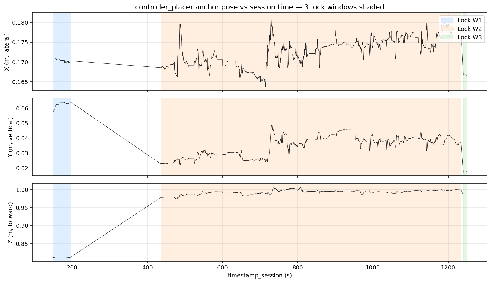
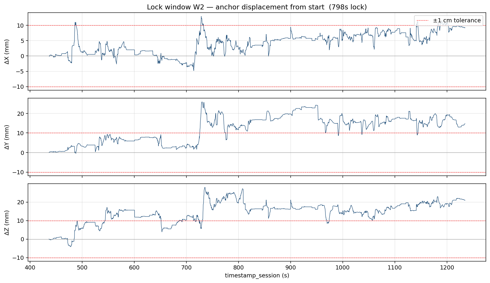
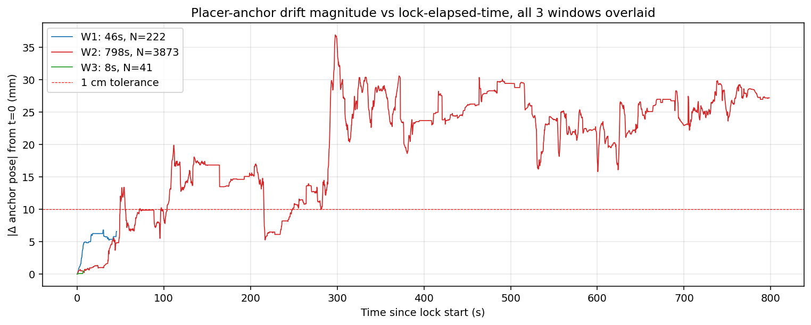

# Quest Camera Kit — Session Log Analysis

**Date analyzed:** 2026-05-21
**Files analyzed:**
- `P000_1779328968040.csv` (32 data rows, 42.8 s, *aborted/test session*)
- `P000_1779331256573.csv` (4 577 data rows, 38.7 min, full session)
- Unity application log `2026-05-21_024056_fd774540.log` (pairs with the 38.7-min CSV)
- Unity application log `2026-05-21_211622_4ca5cc80.log` (no matching CSV uploaded)

**Build:** `QVK-ControllerPair_0.1.0_2026-05-20_2135_14559d8-dirty_dev`
**Branch / SHA:** `ControllerCorrections` / `14559d8` (dirty)
**Device:** Oculus Quest 3 / Android 14 / Unity 6000.3.11f1
**Schema version:** 1 (both CSVs)

---

## TL;DR

1. **The headline analysis from the handoff cannot be performed on this data.** Comparing `anchor_baseline` (AprilTag) drift against `controller_placer` drift requires both streams. **There are zero `anchor_baseline` rows in either CSV** — the AprilTag constellation never auto-calibrated during these sessions, so the AnchorBaselineLogger never emitted. Only `controller_placer` snapshots exist.
2. **The placer-anchor measurements that *do* exist already show the experiment well outside its 1 cm tolerance.** In the 13.3-minute "W2" lock window, the OVRSpatialAnchor drifted up to **36.9 mm** from its starting position — 3.7× the experimental budget.
3. **The drift is not gradual — it is a step.** The anchor sits at ~11 mm mean displacement until t = 736 s when controller R disconnects. After that event the displacement jumps to ~25–29 mm and remains there for the rest of W2. This correlation is the most actionable finding from this session.
4. **Walks 0 was loaded but never completed** in the 38.7-min session — no `walk_phase=moved`, no `reset`, no `end`. The only obstacle activity was three manual `obstacle_placer_lock` toggles by the experimenter.
5. **No rigid-body baseline was captured this session.** Zero `calibration_event` rows; no `session_event subtype=rigid_body_baseline`. The validator therefore has no reference to gate against.
6. **Battery readings are 0 % on every sample** for both controllers — almost certainly a logging/API bug, not real data. Recommend treating `battery_L/R_percent` as unreliable in this build.
7. **Two `session_event` subtypes are emitted that are not documented in the handoff:** `display_frequency` (1 event at startup) and `finesse_target` (9 events during the session, tracking which target the FinesseController is editing). Recommend adding both to the schema reference.
8. **`reconnect_moved` warnings up to 5.42 m** are present at session start (controllers settling into the rig after pickup) and at t = 1786 s (after a 476 s gap where the headset was unmounted then re-mounted). Far beyond the 5 cm warn threshold but explainable by the participant putting the headset down.

---

## 1 · The two CSVs side-by-side

| | `P000_1779328968040.csv` | `P000_1779331256573.csv` |
|---|---|---|
| Session start (UTC) | 2026-05-21T02:02:48.040Z | 2026-05-21T02:40:56.573Z |
| Duration | 42.8 s | 2 324.1 s (38.7 min) |
| Data rows (excl. header) | 32 | 4 577 |
| `session_event` rows | 12 | 21 |
| `state_snapshot` (`controller_placer`) | 0 | 4 136 (3 872 of which are in W2) |
| `state_snapshot` (`anchor_baseline`) | **0** | **0** |
| `walk_event` rows | 1 (`walk 0 start`) | 1 (`walk 0 start`) |
| `calibration_event` rows | 0 | 0 |
| `sleep_event` pulses | 7 | 370 |
| `sleep_event` disconnect / reconnect | 2 / 2 | 10 / 8 |
| `sleep_event` battery_sample | 1 | 31 |
| Matching Unity .log uploaded | **No** | Yes (02:40 session) |
| Clean exit (per `sessionEndUtc` JSON) | n/a (no JSON) | No (`cleanExit:false`) |

The smaller CSV is clearly an aborted or pre-flight test. There is no completed activity in it. The remainder of this report focuses on the 38.7-minute session, which is where all the substantive data lives.

The Unity log for the 21:16 UTC session indicates a second run occurred but its CSV is not in this upload set.

---

## 2 · The missing `anchor_baseline` stream

Per the handoff:

> `correction_source=='anchor_baseline'` rows come from `AnchorBaselineLogger`, ~5 Hz, **always on once the AprilTag constellation is calibrated**. They populate `anchor_pos_xyz` / `anchor_rot_xyzw` (the AprilTag anchor's bare world pose) …

Both CSVs contain zero rows with `correction_source=='anchor_baseline'`. The reason is visible in the Unity log:

| t (CSV) | Wall clock | Event | Source |
|---|---|---|---|
| 0.000 | 02:40:56.020 | Build/init log | Unity log |
| 0.55 (≈) | 02:40:56.551 | `[Warning] [AprilTagDisplayManager] No MarkerPool assigned and no singleton found. Markers will not spawn.` | Unity log |
| 888.13 | 02:55:44.701 | `finesse_target → apriltag` (manual switch) | CSV |
| 899.52 | 02:55:56.094 | `[ConstellationDriftCorrector] Streaming calibration started.` | Unity log |
| 959.53 | 02:56:56.101 | `[ConstellationDriftCorrector] Streaming calibration auto-cancelled after 60 s.` | Unity log |

The auto-calibration path (≥ 3 tags visible for 5 consecutive frames) never triggered, the experimenter's manual streaming-calibration sweep at t = 900 s **timed out at 60 s without succeeding**, and the constellation was never paired. With no calibrated constellation, no `OVRSpatialAnchor` for the AprilTag system is created, so `AnchorBaselineLogger` has nothing to sample.

**Implication for the project:** the AprilTag pipeline did not produce any data this session. If the goal of the session was to compare the two anchor systems, the session does not contribute to that comparison.

---

## 3 · Session-1 timeline reconstruction

Wall clock is computed as `session_start (1 779 331 256.573 ms) + timestamp_session × 1000`. All bracketed `[Unity log]` entries below come from the matching `.log` file and were used to validate that the CSV's `timestamp_session` axis lines up with the application's wall clock (it does — every cross-checked event matches to within ~30 ms, well below the 200 ms snapshot period).

| t (s) | Wall clock UTC | Event | Notes |
|---:|---|---|---|
| 0.00 | 02:40:56.573 | `session_event session_start` (build 0.1.0, scene "Triangle Constellation Pairing Down (Corrected)", participant P000) | |
| 0.07 | 02:40:56.65 | `walk_event walk 0 start` (active=1, towards=0, trigger=0.70 m, perturbation=0.35 m) | Walk never ends in this CSV |
| 0.08 | 02:40:56.66 | `session_event display_frequency` (90 Hz requested & applied, cpu/gpu level 4) | Subtype not in handoff |
| 0.10 | 02:40:56.68 | `sleep_event battery_sample` — both controllers report 0 % | First of many 0 % readings; suspect bug |
| 0.36 | 02:40:56.94 | both controllers `disconnect` | Startup transient |
| 0.80 | 02:40:57.37 | both controllers `reconnect` + `reconnect_moved` (L = 0.97 m, R = 1.04 m) | Matches Unity log warnings at 02:40:57.371 |
| 28.94 → 195.22 | 02:41:25 – 02:44:11 | 4 × `finesse_target` switches and lock W1 cycle | Experimenter switching FinesseController targets while positioning the obstacle |
| **149.62** | 02:43:26.19 | `obstacle_placer_lock locked=1` — **W1 anchor created** at (0.171, 0.058, 0.811) | Matches Unity `[ControllerObstaclePlacer] Anchor created at (0.17, 0.06, 0.81)` — anchor UUID `9248643b-…` |
| 195.22 | 02:44:11.79 | `obstacle_placer_lock locked=0` — W1 anchor destroyed | Lock duration 45.6 s |
| **436.38** | 02:48:12.95 | `obstacle_placer_lock locked=1` — **W2 anchor created** at (0.169, 0.022, 0.979) | Matches Unity `Anchor created at (0.17, 0.02, 0.98)` — anchor UUID `a973cde3-…` |
| 736.08 → 740.79 | 02:53:12 – 02:53:17 | R then L controller `disconnect` | ⚠ **Drift step change at this point** (§4) |
| 873.57 → 882.57 | 02:55:30 – 02:55:39 | L then R controller `reconnect` (no `reconnect_moved` — within threshold) | |
| 888.13 | 02:55:44.70 | `finesse_target target=apriltag` | Operator switches to the AprilTag pipeline |
| 899.52 | 02:55:56.10 | Streaming AprilTag calibration started | Per Unity log |
| 959.53 | 02:56:56.10 | Streaming calibration auto-cancels (60 s timeout) | Per Unity log |
| 1198.36 → 1200.56 | 03:00:54 – 03:00:57 | L then R `disconnect` | |
| 1225.44 → 1226.57 | 03:01:22 – 03:01:23 | R then L `reconnect` | |
| 1234.87 | 03:01:31.44 | `obstacle_placer_lock locked=0` — W2 anchor destroyed | Lock duration 798.5 s (13.3 min) |
| 1240.27 | 03:01:36.84 | `obstacle_placer_lock locked=1` — **W3 anchor created** at (0.167, 0.017, 0.985) | Anchor UUID `82102cdc-…` |
| 1248.47 | 03:01:45.04 | `obstacle_placer_lock locked=0` — W3 anchor destroyed | Lock duration 8.2 s |
| ~1294 | 03:02:30.90 | HMD unmounted | Per Unity log; no explicit CSV row |
| 1307.16 | 03:02:43.73 | last pulse before HMD-off | |
| 1780.78 | 03:10:37.35 | both controllers `disconnect` (HMD re-mounted in Unity log) | 476 s gap in pulse stream — see §5 |
| 1783.27 | 03:10:39.84 | first pulse after HMD-on (`time_since_last_pulse_s = 476.11`) | |
| 1785.81 / 1786.48 | 03:10:42.39 / 03:10:43.05 | R/L `reconnect` + `reconnect_moved` (R = 5.42 m, L = 3.67 m) | Headset put down then picked up |
| 2321.22 | 03:19:37.79 | both controllers `disconnect` | End-of-session settle |
| 2324.13 | 03:19:40.70 | last row in CSV | **No `session_end` / `application_quit` row** — abrupt termination |

### Notable: no explicit session_end

Neither CSV ends with a `session_event subtype=session_end` or `application_quit`. The session JSON's `cleanExit:false` is consistent with this. Per the handoff §369, a normal shutdown should write one of these. Worth investigating whether the writer flush at termination is reliable on this build.

---

## 4 · Placer-anchor drift — the actual signal in this CSV

The 4 136 `controller_placer` state snapshots fall into three lock windows. In each, only `anchor_pos_xyz` and `anchor_rot_xyzw` are populated — the other pose fields (headset, controllers) are empty as the handoff specifies for this source.

### 4.1 Per-window summary

| Window | t range (s) | Duration | N samples | Start anchor (m) | End anchor (m) | Net Δ | Range X / Y / Z | Std X / Y / Z |
|---|---|---:|---:|---|---|---:|---|---|
| W1 | 149.6 – 195.2 | 45.6 s | 222 | (0.171, 0.058, 0.811) | (0.170, 0.064, 0.811) | 6.6 mm | 1.5 / 6.5 / 2.5 mm | 0.37 / 1.59 / 0.58 mm |
| **W2** | **436.4 – 1234.9** | **798.5 s** | **3 872** | (0.169, 0.022, 0.979) | (0.178, 0.037, 1.000) | **27.2 mm** | **17.7 / 26.4 / 32.1 mm** | **3.46 / 6.68 / 5.86 mm** |
| W3 | 1240.3 – 1248.5 | 8.2 s | 41 | (0.167, 0.017, 0.985) | (0.167, 0.017, 0.985) | 0.4 mm | 0.3 / 0.4 / 0.5 mm | 0.05 / 0.11 / 0.12 mm |

Sample period: median 208–209 ms across all three windows (4.78 Hz). No within-window gap exceeds 235 ms — sampling is healthy whenever a lock is held.

W3 is too short to see drift. W1 already shows ~6 mm of vertical motion in under a minute. **W2 is the diagnostic window.**



### 4.2 W2 — drift vs disconnects

The peak displacement in W2 is **36.94 mm at t = 734.2 s** — coincident with the R-controller disconnect at t = 736.08 s. After the disconnect, the anchor jumps to a new offset and stays there. The peak is even larger than the net W2-end displacement (27 mm), because the anchor briefly overshoots before settling.

Breaking W2 into segments delimited by controller events:

| Segment | Bounds (s) | Duration | N | Mean ‖Δ‖ | Max ‖Δ‖ |
|---|---|---:|---:|---:|---:|
| W2 start → R disconnect | 436.4 – 736.1 | 299.7 s | 1 453 | **11.1 mm** | 36.9 mm |
| R disc → L disc | 736.1 – 740.8 | 4.7 s | 23 | 32.2 mm | 35.9 mm |
| L disc → L reconnect | 740.8 – 873.6 | 132.8 s | 645 | 25.2 mm | 30.6 mm |
| L recon → R reconnect | 873.6 – 882.6 | 9.0 s | 43 | 24.5 mm | 25.3 mm |
| R recon → L disc 2 | 882.6 – 1198.4 | 315.8 s | 1 530 | 24.9 mm | 30.4 mm |
| L disc 2 → R disc 2 | 1198.4 – 1200.6 | 2.2 s | 11 | 29.0 mm | 29.3 mm |
| R disc 2 → R recon 2 | 1200.6 – 1225.4 | 24.9 s | 121 | 28.0 mm | 29.3 mm |
| R recon 2 → L recon 2 | 1225.4 – 1226.6 | 1.1 s | 6 | 27.0 mm | 27.0 mm |
| L recon 2 → W2 end | 1226.6 – 1234.9 | 8.3 s | 40 | 27.2 mm | 27.4 mm |

The pattern is consistent: before the first controller disconnect at t = 736 s, mean displacement is ~11 mm. After it, mean displacement holds at 25–29 mm for the remainder of W2 and never returns to baseline, even after both controllers reconnect.



This is interesting because the OVRSpatialAnchor is supposed to be tracked against the headset's SLAM, not against the controllers. A disconnect-correlated step in the anchor pose suggests either (a) the SLAM map update is being triggered by the controller tracking state, or (b) the disconnect coincided with an unrelated SLAM correction. Worth checking against the next session's data once the AprilTag baseline is available — the constellation anchor should respond differently to the same SLAM correction if it's a global map update.

### 4.3 Lock-windows overlaid



W2 is the only window long enough to draw conclusions from. W1's growth rate (~6 mm in 45 s) is plausibly the same regime as the pre-disconnect portion of W2.

---

## 5 · Controller health and sleep mitigation

### 5.1 Pulse cadence — clean

370 keep-alive pulses over the session. Mean inter-pulse `time_since_last_pulse_s = 5.007 s`, std = 0.007 s. Pulses are firing exactly on schedule. **One outlier:** a 476.1 s gap between t = 1307.2 s and t = 1783.3 s, which corresponds to the HMD-off window (03:02:43 to 03:10:39 UTC). The Unity log confirms `OnApplicationPause(true)` at 03:02:45 and `OnApplicationPause(false)` at 03:10:35. Expected behavior; flagging only because it makes "is the pulse stream healthy?" require a filter for HMD-off intervals.

### 5.2 Disconnect / reconnect events

8 reconnect events across the session. Two pairs have `reconnect_moved` warnings:

| t (s) | Side | Moved | Notes |
|---:|---|---:|---|
| 0.80 | L | 97.0 cm | Startup — controllers being picked up |
| 0.80 | R | 104.1 cm | Startup — controllers being picked up |
| 1785.81 | R | **541.9 cm** | Post HMD-off, headset put down and re-donned |
| 1786.48 | L | 366.9 cm | Post HMD-off |

The middle two disconnect/reconnect cycles (W2 at t = 736 → 873 and t = 1198 → 1226) had **no** `reconnect_moved` — the controllers were within 5 cm of their last-known pose, consistent with the rig holding them stationary. These mid-session disconnects are sleep-mode events, not physical disturbances.

The W2 mid-session disconnects (without movement) still correlate with anchor pose changes. If `ControllerSleepMitigation` is meant to keep the controllers awake, these gaps suggest the haptic pulse isn't fully preventing sleep on this build — or the controllers' optical visibility is dropping. Worth confirming whether the controllers were inside the headset's field of view during those windows.

### 5.3 Battery — likely bug

Every battery_sample row (31 samples over the session) reports **0 % for both controllers**. This is implausible for a 38-minute session that ended with `cleanExit:false` rather than an OOB low-battery shutdown. Recommend auditing the `OVRInput.GetActiveControllerBatteryPercentRemaining` (or equivalent) usage in the `ControllerSleepMitigation` component — possibly being called against a `Controller` enum value (`LTouch`/`RTouch`) that the API doesn't recognize, or possibly an Active vs Per-Controller mismatch.

### 5.4 Controller validity / inter-controller distance

Not measurable from this CSV: the `controller_placer` source does not populate `position_valid_*`, `velocity_*_mps`, `inter_controller_distance_m`, or `deviation_from_baseline_m`. Per the handoff, those fields populate on `anchor_baseline` snapshots — which are absent here. The rigid-body validator's behavior is therefore opaque in this session.

---

## 6 · Trial / walk activity

| Field | Value |
|---|---|
| `walk_event` rows | 1 (`walk_phase=start`) |
| Walks completed | 0 |
| Trials loaded | 23 (per Unity log: `[TrialLoader] Loaded 23 trials`) |
| Walk 0 parameters | `trial_active=1`, `move_towards_user=0`, `trigger=0.70 m`, `perturbation=0.35 m` |

No `walk_phase=moved`, `reset`, or `end` was ever emitted. The participant did not walk a single trial across the gait mat during this session.

Combined with the AprilTag never calibrating and the experimenter spending the session toggling FinesseController targets and placer locks, **this session looks like a setup / debug session rather than a participant trial run.**

---

## 7 · Schema observations / handoff document updates

These are minor but worth folding into the handoff so the next reader doesn't have to re-discover them.

### 7.1 Two undocumented `session_event` subtypes

| `subtype` | Count this session | `detail` example |
|---|---:|---|
| `display_frequency` | 1 (small CSV) + 1 (large CSV) | `requested=90;applied=90;supported=1;before=90;available=[72,80,90,120];cpu_level=4;gpu_level=4` |
| `finesse_target` | 4 (small CSV) + 9 (large CSV) | `target=placer` / `target=controller` / `target=apriltag` |

Neither appears in the handoff's `session_event` subtype table (§267). Suggested addition:

> `display_frequency` — emitted once after `XRDisplayConfigurator` applies a refresh-rate setting. `detail` keys: `requested`, `applied`, `supported`, `before`, `available`, `cpu_level`, `gpu_level`.
>
> `finesse_target` — emitted when the experimenter changes which target the `FinesseController` is editing. `detail` key: `target` ∈ {`placer`, `controller`, `apriltag`}.

### 7.2 BOM in CSV header

Both CSVs start with a UTF-8 BOM (``) before the first column name. The handoff's example pandas snippet (`pd.read_csv(...)`) without `encoding="utf-8-sig"` will leave the BOM glued to the first column name as `schema_version`. Suggested update to the example:

```python
df = pd.read_csv(path, low_memory=False, encoding="utf-8-sig")
```

### 7.3 Battery cells

Empty cells in `battery_L/R_percent` are documented as "null/unknown." On this build the cells are populated with `0` when both controllers are disconnected (e.g., the t=0.10 s sample where both controllers were down). That's a "0 means 'no data'" overload that conflicts with the handoff's claim that `0/1` boolean cells use empty = null and a real 0 means "false." For a non-boolean float, 0 is ambiguous between "really 0 %" and "no data." Recommend either (a) leaving the cell empty when the controller is disconnected, or (b) documenting that 0 here means "unavailable."

---

## 8 · Recommended next steps for the project

In order of expected payoff:

1. **Fix the AprilTag MarkerPool wiring.** The session-1 startup warning `[AprilTagDisplayManager] No MarkerPool assigned and no singleton found. Markers will not spawn.` is the root cause of the missing baseline data. Until this is wired, no session can produce the `anchor_baseline` stream the analysis is built around.
2. **Re-run the same protocol once the constellation calibrates.** The W2 drift signature (~11 mm baseline drift, step-change correlated with controller disconnect) is interesting on its own, but un-interpretable without the parallel `anchor_baseline` trace. Re-running with both streams active is what unlocks the comparison.
3. **Investigate the disconnect-correlated step.** A 25 mm anchor step that coincides with a controller disconnect — but persists after the controller reconnects — is the kind of artefact that would silently ruin a session even if a participant walked through it normally. Two cheap diagnostics: log the headset's `OVRManager.TrackingAcquired/TrackingLost` events into the CSV alongside controller disconnects, and add a `frame_number`-level delta between consecutive anchor snapshots so SLAM correction steps are visible.
4. **Audit the battery API call.** Whatever is filling `battery_L/R_percent` is producing 0 in conditions where it should produce ~60–100. Cheap to fix and the field is referenced by the sleep-mitigation heuristic.
5. **Add a graceful-shutdown path.** Both sessions ended without `session_end` / `application_quit`. The session JSON's `cleanExit:false` agrees. If the writer is buffering 2 s worth of data (`flush_interval_s=2.00` per the header) and the app process exits before flush, the last 2 s of state could also be lost.
6. **Document `display_frequency` and `finesse_target`** in the handoff so future analyses don't trip over unknown subtypes.

---

## 9 · Data-quality flags summary

| Flag | Severity | Where |
|---|---|---|
| Zero `anchor_baseline` rows (AprilTag never calibrated) | **High** — blocks headline analysis | Both sessions |
| Zero `calibration_event` rows (no rigid-body baseline captured) | Medium — rigid-body validator has no reference | Both sessions |
| Battery readings always 0 % | Medium — likely API bug | Large CSV (31 samples) |
| No `session_end` / `application_quit` on shutdown | Low — termination is abrupt; possible 2 s data loss at end | Both sessions |
| BOM at start of CSV header | Low — needs `utf-8-sig` to parse cleanly | Both sessions |
| `reconnect_moved` warnings > 1 m | Informational — explainable by headset-off / settling | Session start & t = 1786 s |
| Anchor step correlated with controller disconnect | Investigative — primary finding of this analysis | Large CSV, W2 at t ≈ 736 s |

---

*Plots in this report:*
- `placer_anchor_xyz.png` — anchor X/Y/Z over the full 38.7-min session, three lock windows shaded.
- `W2_drift_from_start.png` — anchor displacement components (ΔX/ΔY/ΔZ in mm) during the long W2 lock window, with ±1 cm tolerance lines.
- `lock_windows_overlay.png` — drift magnitude vs lock-elapsed-time, all three windows overlaid on a common axis.
